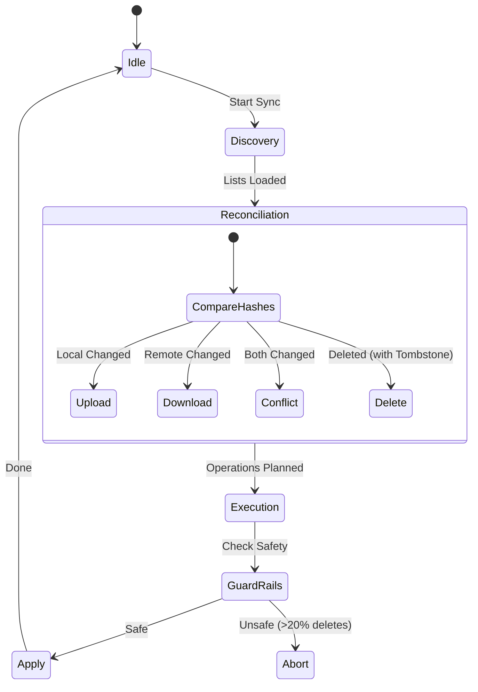

# 📱 Project Analysis: LinkLet (Org-Roam Mobile)

**Date:** December 24, 2025
**Version:** 0.1.0 (MVP)

## 1. Executive Summary

**LinkLet** is a modern, offline-first Android application designed to bring the power of **Org-roam** to mobile devices. It allows users to view, edit, search, and synchronize their personal knowledge base (PKB) stored in pl

The project prioritizes **data ownership** (local files are the source of truth), **performance** (caching and indexing), and **robust synchronization** (WebDAV with conflict resolution and safety guard rails).

---

## 2. Product Manager View 🚀

### Core Value Proposition
LinkLet bridges the gap between desktop Org-mode power users and mobile accessibility. It serves as a "read-heavy, write-light" companion app that ensures your digital garden is always in your pocket.

### Key Features

| Feature | Description | Status |
| :--- | :--- | :--- |
| **Note Browsing** | View a list of all notes, sorted by title or last modified. | ✅ Implemented |
| **Rich Rendering** | Renders Org-mode syntax (Headings, Links, Source Blocks, Tables) natively. | ✅ Implemented |
| **Backlinks** | Automatically indexes and displays "linked references" at the bottom of notes. | ✅ Implemented |
| **Search** | Full-text search within notes (Literal & Regex) and global file search. | ✅ Implemented |
| **Editing** | Basic text editor for quick captures and corrections. | ✅ Implemented |
| **Synchronization** | Two-way sync with WebDAV servers (Nextcloud, etc.) via background workers. | ✅ Implemented |
| **Trash Management** | Soft-delete functionality with restore capability. | ✅ Implemented |
| **Properties & Tags** | View and edit file-level tags and property drawers (e.g., `:ID:`). | ✅ Implemented |

### User Flows

1.  **Onboarding:** User selects a local folder on their device (via Android Storage Access Framework) to serve as the note repository.
2.  **Sync Setup:** User configures WebDAV credentials. The app performs an initial "Discovery" and "Reconciliation" to merge local and remote states.
3.  **Navigation:**
    *   **Home:** List of notes.
    *   **View:** Tap a note to read. Click `[[wiki links]]` to navigate instantly to other notes.
    *   **Edit:** specialized editor for raw text manipulation.
4.  **Daily Workflow:** User reads notes, follows links to discover connections, makes quick edits, and the app syncs changes in the background.

---

## 3. Software Architect View 🏛️

### High-Level Architecture
The application follows a clean **MVVM (Model-View-ViewModel)** architecture, heavily relying on **Dependency Injection (Hilt)** and **Reactive Streams (Kotlin Flows)**.

```mermaid
graph TD
    User((User)) --> UI[UI Layer\n(Jetpack Compose)]
    UI --> VM[ViewModels]
    VM --> Domain[Domain Layer\n(Use Cases / Repositories)]
    
    subgraph Domain Layer
        Repo[NoteRepository]
        Search[SearchEngine]
    end
    
    Domain --> Data[Data Layer]
    
    subgraph Data Layer
        Store[Storage Service\n(SAF / DocumentFile)]
        Parser[Org Parser\n(Regex State Machine)]
        Index[SQLite Index\n(Room Database)]
        Sync[Sync Engine\n(WebDAV / WorkManager)]
    end
    
    Store <--> FS[(Local File System)]
    Index <--> DB[(SQLite DB)]
    Sync <--> Cloud((WebDAV Server))
```

### Core Components

#### 1. Domain Layer (`com.gladomat.linklet.domain`)
*   **`Note` Entity:** The central data structure. Represents a parsed Org file, containing metadata (`NoteId`, title, tags, properties) and the raw content.
*   **`INoteRepository`:** The primary interface for the UI. It abstracts away the complexity of raw file storage, parsing, and SQL indexing.
*   **`NoteSearchEngine`:** A pure functional component that performs in-memory text search (Regex/Literal) over parsed note blocks.

#### 2. Data Layer (`com.gladomat.linklet.data`)
This layer is responsible for the "Three Pillars of Truth": **Files**, **Index**, and **Sync State**.

*   **Storage (`DocumentTreeStorageImpl`):
    *   Wraps Android's **Storage Access Framework (SAF)**.
    *   Optimizes performance by caching `DocumentFile` references to avoid expensive content provider lookups during directory traversal.
    *   Handles file IO (Read/Write/Delete/Rename).
*   **Parser (`OrgDocumentParser`):
    *   A custom State Machine parser.
    *   Identifies blocks: `SRC`, `QUOTE`, `TABLE`, `Heading`, `Property Drawer`.
    *   Extracts metadata (`#+title`, `#+filetags`) and links (`[[target][label]]`).
*   **Index (`NoteDatabase` / Room):
    *   Maintains a relational cache of metadata.
    *   Tables: `notes` (path, title), `links` (source, target), `sync_state` (sync tracking).
    *   Enables O(1) backlink lookups and fast listing.
*   **Sync (`SyncEngine`):
    *   Implements a robust state-based synchronization algorithm.
    *   **Phases:**
        1.  **Discovery:** Scan local files (compute hashes) vs Remote files (fetch fingerprints).
        2.  **Reconciliation:** Compare with `SyncState` DB to detect changes (Local Modified, Remote Modified, Conflict).
        3.  **Execution:** Apply actions (Upload, Download, Delete).
    *   **Safety:** Includes "Guard Rails" to prevent catastrophic data loss (e.g., aborts if sync tries to delete >20% of remote files without confirmation).

#### 3. UI Layer (`com.gladomat.linklet.ui`)
*   **Jetpack Compose:** 100% declarative UI.
*   **Navigation:** Single-Activity architecture using `NavHost`.
*   **Screen Composition:** 
    *   `NoteViewScreen`: Dynamically renders Org blocks. Handles "active search" highlighting.
    *   `NoteListScreen`: Lazy loading of note items.

---

## 4. Software Developer View 💻

### Project Structure Map

| Package | Purpose | Key Files |
| :--- | :--- | :--- |
| `app` | DI & App entry point | `LinkLetApp.kt`, `AppModule.kt` |
| `data.model` | Domain Entities | `Note.kt`, `NoteId.kt` |
| `data.storage` | File System Access | `DocumentTreeStorageImpl.kt`, `IStorage.kt` |
| `data.parser` | Parsing Logic | `OrgDocumentParser.kt`, `RegexParser.kt` |
| `data.sync` | Synchronization | `SyncEngine.kt`, `WebDAVRemoteSyncProvider.kt` |
| `data.index` | Database (Room) | `NoteDao.kt`, `NoteDatabase.kt` |
| `domain.repository` | Business Logic | `NoteRepositoryImpl.kt` |
| `ui.screens` | Compose Screens | `NoteViewScreen.kt`, `NoteListScreen.kt` |
| `viewmodel` | State Management | `NoteViewViewModel.kt`, `NoteListViewModel.kt` |

### Key Implementation Details

#### The Sync Engine State Machine
The sync logic is non-trivial. It uses a `SyncState` entity to track the "Last Known Good" state of every file.



#### Parsing Strategy
Instead of a full AST, the app uses a **Block-Based Regex Parser**.
1.  **Line Scan:** Identifies structural markers (Headings `*`, Blocks `#+BEGIN`).
2.  **State Machine:** transitions between `Idle`, `InBlock` (e.g., inside a Source block), and `InTable`.
3.  **Metadata Extraction:** `extractProperties` and `extractFileTags` run on the header lines to populate the `Note` object.

#### Storage Performance
SAF is notoriously slow. `DocumentTreeStorageImpl` mitigates this by:
*   Caching the root `DocumentFile`.
*   Using `ContentResolver` streams directly where possible.
*   Minimizing directory traversals during simple reads.

### Build & Dependencies
*   **Build System:** Gradle Kotlin DSL (`build.gradle.kts`)
*   **Min SDK:** 26 (Android 8.0)
*   **Target SDK:** 34
*   **Key Libs:**
    *   `androidx.compose`: UI
    *   `com.google.dagger:hilt`: Dependency Injection
    *   `androidx.room`: Local Database
    *   `com.github.thegrizzlylabs:sardine-android`: WebDAV Client
    *   `androidx.work`: Background Sync Jobs

### Testing Strategy
*   **Unit Tests:** Heavy focus on `ParserTests`, `SyncEngine` logic (mocked storage), and `ViewModel` state transitions.
*   **UI Tests:** Minimal usage, focusing mostly on navigation.
*   **Debug Tools:** Extensive logging in `SyncEngine` (tagged `SyncEngine`) to trace the reconciliation decision tree.

---
